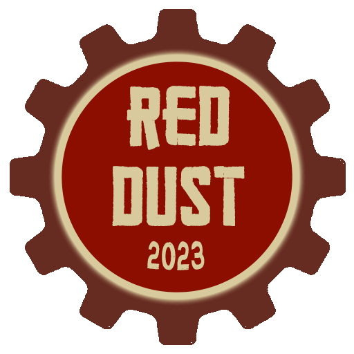
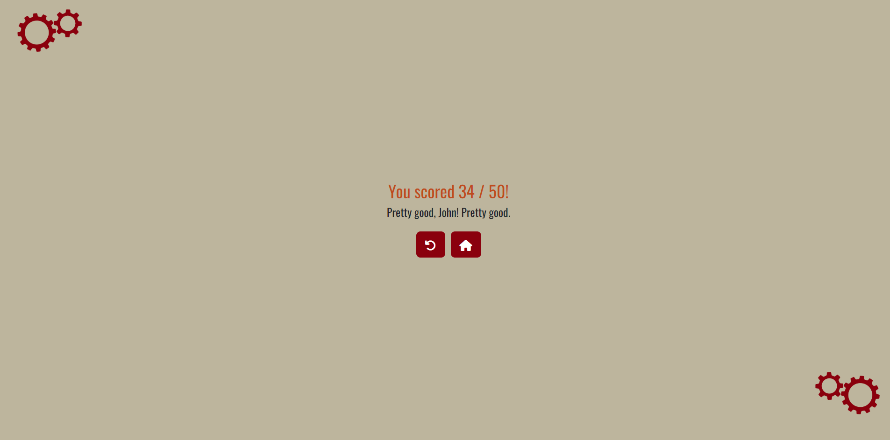
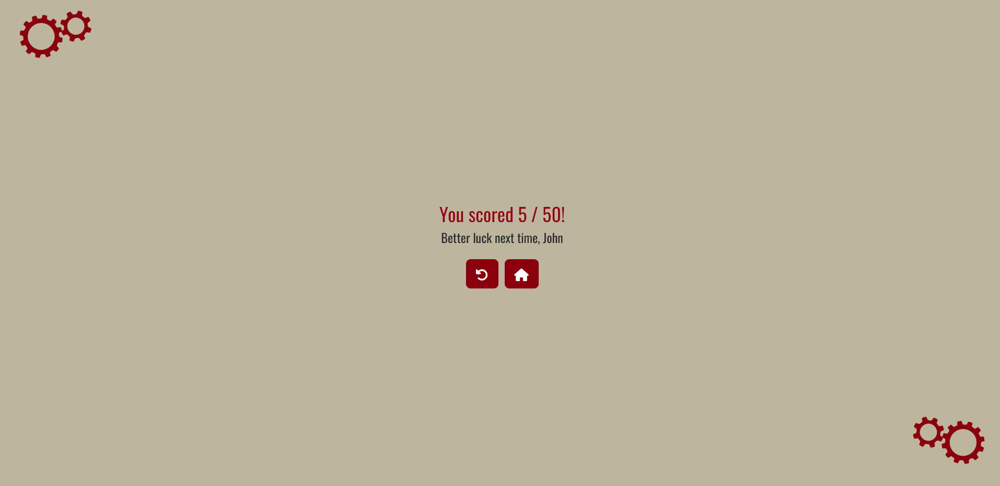

# Red Dust Festival 2023

## A User Centric, Interactive, Front End Development Project

# Contents
1. [Introduction](#introduction)
2. [Instructions](#instructions)
3. [UX](#user-centric--interactive-ux)
    - [Application Goals](#application-goals)
    - [User Stories](#user-stories)
4. [Project Wireframes & Mockups](#project-wireframes--mockups)
5. [Design Choices](#design-choices)
6. [UI](#ui)
    - [Application Features](#application-features)
7. [Testing](#testing)
8. [Deployment](#deployment)
9. [Acknowledgements](#acknowledgements)

# Introduction
This website is for 'Red Dust Festival, 2023': a fictional two day music festival celebrating dance and rock music held in the former steel town of Consett, Co. Durham, UK.

The site provides a space to advertise the festival, show off its line-up and tell users what it is about. It also allows users to get in contact and buy tickets. The site features an interactive JavaScript music trivia quiz for users to test their music knowledge. 

### *Disclaimer*
*The example festival, organisation/s, products (i.e. ticket sales), contact information, logos, images, videos and events herein are fictitious. No association with any real festival, organisation/s or person/s is intended nor inferred. 
It must be stressed that the artists featured on the festival's line-up have no association with this example festival. Their names are included for demonstrative purposes only.
The examples included here on this site are featured only for the sole purpose of showcasing my project for the Interactive Front End Development Module for the Level 5 Diploma in Web Application Development.*

# Instructions

## Live Preview
To view a live preview of the site, simply navigate to the domain hosted on GitHub Pages.

### Link to Site on GitHub Pages:
Click: [HERE](https://ozpc99.github.io/Red-Dust-2023/) or copy and paste this link: https://ozpc99.github.io/Red-Dust-2023/ into your browser.

The link is also shown in the 'About' section of the GitHub repository: ozpc99/Red-Dust-2023

## Cloning the GitHub Repository
1. Navigate to the GitHub Repository: ozpc99/Red-Dust-2023
    - Click: [HERE](https://github.com/ozpc99/Red-Dust-2023) or copy and paste this link: https://github.com/ozpc99/Red-Dust-2023 into your browser.
2. Then click the green 'Code' button:

3. Select: 'Local'.
4. Select: 'HTTPS' and copy the link.
5. Ensure you have Git installed.
    - If Git is not installed, install it by clicking: [HERE](https://git-scm.com/downloads) or copy and paste this link: https://git-scm.com/downloads into your browser.
    - Select your operating system and follow the instructions on the installation wizard.
    - Once installed, restart your machine and go back to step 1.
6. Open your IDE, I recommend Microsoft Visual Studio Code.
7. Open a new Git Bash terminal.
    - Select 'Terminal' > 'New Terminal' from the top menu bar or press Ctrl + Shift + ` (on Windows)
    - Ensure the terminal is running Git Bash.
        - If it isn't, select the '+' icon in the terminal window and select Git Bash from the dropdown menu.
8. In the terminal, type: `git clone` followed by the URL you copied earlier.
9. Press the 'Enter' key and the repository will be cloned. 

- Further documentation is available on GitHub's website: [Cloning a Repository](https://docs.github.com/en/repositories/creating-and-managing-repositories/cloning-a-repository?tool=webui)

## Virtual IDEs
### Opening the code in Codespaces:
1. Navigate to the GitHub Repository: ozpc99/Red-Dust-2023
    - Click: [HERE](https://github.com/ozpc99/Red-Dust-2023) or copy and paste this link: https://github.com/ozpc99/Red-Dust-2023 into your browser.
2. Then click the green 'Code' button:

3. Select: 'Codespaces'
4. Click the '+' icon to create a codespace on main.
5. Codespaces will create your workspace.

- Further documentation is available on GitHub's website: [Creating a Codespace for a Repository](https://docs.github.com/en/codespaces/developing-in-codespaces/creating-a-codespace-for-a-repository)

### Opening the code in GitPod:
1. Navigate to the GitHub Repository: ozpc99/Red-Dust-2023
    - Click: [HERE](https://github.com/ozpc99/Red-Dust-2023) or copy and paste this link: https://github.com/ozpc99/Red-Dust-2023 into your browser.

*NB- GitHub have removed the green GitPod button from their UI in favour of Codespaces. You can still use GitPod and here's how to do it:*

2. To open a GitHub repository in GitPod, prefix the GitHub repository's URL with: `gitpod.io/#`
3. The link to open Red-Dust-2023 in GitPod is therefore:
https://gitpod.io/#https://github.com/ozpc99/Red-Dust-2023
4. Click: 'Continue with GitHub' and sign in with your GitHub credentials.
5. You will be asked to create a new workspace.
6. Select your desired IDE, I recommend VS Code (Browser).
7. Click: 'Continue' and GitPod will begin cloning the repository and create your workspace.

- Further documentation is available on GitPod's website: [Getting Started](https://www.gitpod.io/docs/introduction/getting-started)

# User-Centric, Interactive UX
## Application Goals:

### 1. To Advertise and Promote the Red Dust 2023 Music Festival.
<ol type="I">
 <h4>
    <li>
        Make conscientious and consistent use of assets and styling choices to promote and instil the festival's brand image and its identity.
    </li>
    </h4>
    <ul>
        <li>
            Colours will be consistent with the festival's theme and colour palette.
        </li>
        <li>
            Icons, images, graphics and logos must be relevant to the content in which they support and consistent with the festival's theme.
        </li>
    </ul>
    <h4>
        <li>
            Have the site default load to an index.html page from the site's primary domain and have the home page load by means of user interaction.
        </li>
    </h4>
    <ul>
        <li>
            The festival's logo will be the center of attention in the middle of the screen.
        </li>
        <li>
            This page will feature a full-screen video background serving to promote the festival and provide a sense of the festival's identity.
        </li>
        <li>
            An 'Enter' button which when clicked, will utilise JavaScript to run a five second loading animation and redirect the user to the Home page.
        </li>
    </ul>
    <h4>
        <li>
            The Home Page will contain primary content promoting the festival to establish and instil the festival's identity.
        </li>
    </h4>
    <ul>
        <li>
            An image carousel will autoplay images associated with the festival. It will feature a call-out and a button linking to the Line-Up section. The images themselves will be of similar content and colour scheme and will draw upon the site's colour scheme and overall theme.
        </li>
        <li>
            The line-up is one of the main reasons that users will visit a music festival website: to see what's on offer. The line-up will have a section dedicated to it and will be displayed close to the top of the home page, in a conventional festival line-up format, using different sized headers to convey hierarchy. The line-up will be split into two columns, one for each day of the festival and genre of music (dance/rock).
        </li>
        <li>
            Provide a dedicated 'Contact' section containing a form where users can send a message to the festival's email address. The contact form should gather the user's inputted details and their message and send this in an email to the festival email address. The contact form should provide user feedback and confirmation that it has successfully sent by redirecting to a confirmation page.
        </li>
        <li>
            Have a section of the home page dedicated to links to supplementary content.
            There will be buttons linking to the page for the interactive Red Dust Music Quiz as well as the Red Dust Radio Spotify Playlists.
        </li>
    </ul>
    <h4>
        <li>
        Provide a dedicated 'Info' page.
        </li>
    </h4>
    <ul>
        <li>
            The Info page should answer in detail the main question that is: 'What is Red Dust Festival?'. It should describe in detail the location and genre of the festival and what users can expect should they want to attend. Images contained in a carousel will be used to support this content.
        </li>
        <li>
            There will also be information about the festival's charity: 'The Red Dust Trust' which will use an image carousel to supplement this, displaying images with captions of the organisations the charity supports.
        </li>
        <li>
            A section dedicated to further information and FAQs will make use of Bootstrap collapses to hide large pieces of information giving control to the user, enabling them to interact on their own terms and view the information they desire piece by piece in a logical and structured manner.
        </li>
    </ul>
    <h4>
        <li>
            Provide a dedicated 'Tickets' Page
        </li>
    </h4>
    <ul>
        <li>
            The process of buying tickets through one of the festival's official vendors will be explained.
        </li>
        <li>
            The costs of going to the festival will be laid out in an easily digestible format such as a table where users can compare ticket prices side by side.
        </li>
        <li>
            Implement a way for the site admin or future developers to easily update the ticket prices displayed in the ticket prices table and the order form without having to edit the HTML. This will be achieved using JavaScript.
        </li>
        <li>
            Provide a dedicated form for booking tickets that allows users to input their contact details and select the type and quantity of the tickets they want. The form will then email the user's submitted details and their order to the festival email address. Upon submission, it should provide immediate user feedback and confirmation by redirecting to a confirmation page.
        </li>
    </ul>
    <h4>
        <li>
            Include a footer to hold contact information, a link to the Red Dust Spotify profile and a newsletter sign-up form.
        </li>
    </h4>
    <ul>
        <li>
            The footer should contain the festival's email address in a link which when clicked, opens the user's default email client.
        </li>
        <li>
            There should be a link to the festival's Spotify profile where users can follow the account and listen to custom playlists curated by Red Dust featuring artists playing at the festival.
        </li>
        <li>
            There should be a newsletter sign-up form where users can submit their email address and the form will send an email to the festival email address saying that this user's submitted email address requests to be added to the newsletter mailing list.
            The newsletter sign-up form should provide user feedback such as redirecting to a confirmation page.
        </li>
        </ul>
    <h4>
        <li>
            Provide a page dedicated to the interactive Red Dust Music Quiz.
        </li>
    </h4>
    <ul>
        <li>
            The quiz will add user interactivity to the site in the form of a fun music trivia game. It also provides additional content to supplement the festival's image and identity. It is hoped that users will have fun playing the quiz and be inclined to share it with friends, competing with each other for the highest score. This will draw more users to the site and provide free advertising for the festival.
            The quiz questions will be of varying difficulty and be displayed in a random order each time the page loads.
            The questions will feature music trivia from a range of genres.
        </li>
        <li>
            The quiz application will be built using HTML and a dedicated, custom CSS stylesheet. It will achieve interactive functionality with vanilla JavaScript.
        </li>
        <li>
            The quiz application will default load to a welcome page where the user can input their name into a form input field. Upon submission (when the continue button is pressed), this value will get stored as an object and pushed to local storage via the script to be deployed later. The page will redirect to the quiz start screen where the user can choose to initiate the quiz via a button or press the 'change player' button to go back and change the name they entered on the previous screen. This adds personalisation and interaction between user and application. The tag in the HTML document where the user's name will be inserted via the script, will be given either a CSS 'text-transform: capitalize' or Bootstrap 'text-capitalize' property to ensure that even if the user enters their name in lower case, it will always be displayed with a capital letter.
        </li>
        <li>
            The quiz should feature user feedback on all interactions in order to achieve interactivity and a positive UX. When a user hovers over an answer option, it will change colour and turn a lighter shade indicating that this is the option they are about to select. When one of the answer options is clicked, it will change colour depending on whether the answer was correct or not. If correct, it will highlight the option in an intuitive colour: green if correct and red if incorrect. Each time the 'Next' button is clicked, the script will continue to load the next question in the array without error or delay until the length of the array has been reached and all questions have been displayed. The number of the question in the array will be displayed at the top of the question card and will increment each time the next button is pressed until the script has finished looping through the question array.
        </li>
        <li>
            The script will keep track of correct answers and when it has finished looping through the questions array, will display the user's score out of the total amount of questions in the array.
        </li>
        <li>
            Alongside the user's score, the quiz will display a different message depending on how they scored featuring the user's name they entered earlier. The message will be displayed in a different colour depending on how highly they scored. Dark green if they answered correctly on all questions, a lighter green if they scored well, green/yellow if they scored okay, orange if they answered roughly 50% correctly, brown if they scored roughly 25% correctly and red if they scored poorly.
        </li>
        <li>
            At the end of the quiz, there will be two buttons containing icons, one with a back arrow to restart the quiz which will link back to the quiz's start screen and another with a house icon to link back to the site's home page. 
        </li>
        <li>
            The quiz will feature animated graphics of turning cogs, consistent with the festival's theme.
        </li>
    </ul>
</ol>

### 2. Implement a User-Centric, Interactive, Intuitive & Accessible UI
<ol type="I">
    <h4>
        <li>
            Ensure the site is fully responsive and developed with a mobile-first approach in mind.
        </li>
    </h4>
    <ul>
        <li>
            The site will be built using a template for responsive design, namely: Bootstrap.   
        </li>
        <li>
            CSS media queries may be used on top of this to aid responsiveness where necessary.
        </li>
        <li>
            Tests will be ran throughout the development process to check for responsiveness. This will be executed with Google Chrome Developer Tools to view a preview of the site on multiple mobile devices.
        </li>
    </ul>
    <h4>
        <li>
            Implement intuitive site navigation.
        </li>
    </h4>
    <ul>
        <li>
            A navigation bar will be used for navigating between pages. It will be positioned at the top of the screen.
        </li>
        <li>
            Ensure all links and buttons on the site work correctly and correspond to the correct page.
        </li>
        <li>
            The links and buttons should provide immediate user feedback when hovered or clicked such as changing colour or becoming underlined.
        </li>
        <li>
            Any external links should open in a new tab so the user does not lose their place on the current page or their attention is not detracted from the Red Dust site.
        </li>
    </ul>
    <h4>
        <li>
            Preserve user-initiated control and interaction.
        </li>
    </h4>
    <ul>
        <li>
            The user must be in control at all times, the site should not do anything unless the user has requested it to do so or interacted with its content.
        </li>
        <li>
            The site must not do anything unintended, uninitiated or unexpected. Testing and de-bugging on a range of web browsers and devices will commence prior to deployment to prevent this. The testing process will be well planned out and documented for future reference.
        </li>
        <li>
            There should be no unexpected pop ups or page jumps. All content must load and scroll into view correctly, without errors, bugs or delay. Code must be formatted correctly without errors and pass a thorough testing and de-bugging process before deployment. File sizes for assets such as images and videos must be minimised as much as is possible without impacting quality to improve loading times. JavaScript documents must be linked at the end of the HTML body to improve loading times unless it is necessary for them to load before the HTML body.
        </li>
    </ul>
    <h4>
        <li>
            Ensure appropriate user feedback/confirmation is provided for all user interactions.
        </li>
    </h4>
    <ul>
        <li>
            Buttons and links should provide user feedback in the form of changing colour when hovered over or in the case of the navigation bar links, becoming underlined and staying underlined when the the page is being viewed.
        </li>
        <li>
            All links must redirect to the correct address and provide the corresponding content the user has selected to view.
        </li>
        <li>
            Collapsible content in the form of Bootstrap collapses should collapse correctly without errors or delay. A caret/arrow icon pointing right will be displayed next to the heading that toggles the collapse when the collapse is closed and will rely on a JavaScript function to toggle rotate the icon to point down when the collapse is open.
        </li>
        <li>
            All forms on the site should redirect to a confirmation page upon submission.
        </li>
    </ul>
    <h4>
        <li>
            Meet accessibility criteria.
        </li>
    </h4>
    <ul>
        <li>
            Text must be displayed in an appropriate size font and colour that is clearly legible and remains legible, retaining its quality when the page is magnified within a browser.
        </li>
        <li>
            Background colours must be chosen carefully to ensure that text in front of it remains legible against the contrast of colours.
        </li>
        <li>
            Images must be of appropriate size and quality and contain descriptive alt attributes for the benefit of visually impaired users and/or should the image fail to load.
        </li>
        <li>
            ARIA roles can be incorporated to allow dynamic content to be more accessible.
        </li>
        <li>
            Pages can be checked for accessibility using dev tools such as Lighthouse Viewer.
        </li>
    </ul>
</ol>

### 3. Meet the Briefs of the User Stories:
### User Stories
#### As a User, I Want To...
- Ultimately have a positive experience while browsing this site. I'm looking at going to a festival so I don't want to be put off if something doesn't work the way I want it to. The content on the site should excite me and make me happy.
- Easily and intuitively navigate between pages.
- Quickly get a sense of the festival's identity and the story behind it.
- Be able to quickly understand what the festival is all about, where it is located, what dates it is held on, how much it will cost to go and who will be featured in the line-up.
- Be able to order tickets online.
- Get answers to FAQs.
- Easily find contact info so I can get in touch with the festival organisers if I have any questions. Being able to send a message directly from the website would be convenient too. When I send my message, I want some form of confirmation that it has actually been sent.
- See images of the festival's previous year so I know what to expect.
- Find links within the site itself to the type of music that I can expect to hear if I go to the festival. Maybe a playlist, media player or link to a music streaming service like Spotify.

#### As the Site Administrator, I Want To...
- Be able to easily, quickly and reliably update the ticket prices without having to edit the HTML should the festival organisers wish to make changes.
- Reliably receive data from the contact form so the support team can get back in touch with the user and answer their questions.
- Reliably receive the email address data from the newsletter sign-up form so the user can be added to the newsletter mailing list.
- Reliably receive orders for tickets from the ticket booking form so the team can add the data to a database and get back in touch with the user to take payment.
- Be able to easily access the code, make changes and deploy the site as and when I need to.
- Access previous versions of the site via the means of version control and choose which version to deploy.

# Project Wireframes & Mockups
## Wireframes
Wireframes for this project can be accessed as a PDF file: [HERE](docs/wireframes.pdf)

The wireframes were created using Balsamiq Wireframes.

## Mockups
The mockups were created using [smartmockups.com](https://smartmockups.com/)
### Desktop

### Tablet

### Mobile

# Design Choices

## Colour Palette
The following colours were chosen to reflect the festival's theme of being held on the site of a former steelworks. The reds, oranges and yellows represent the fire and molten iron found within the forge. The beige colours represent the land and the dirt surrounding the site. The green represents the site's surrounding countryside and natural beauty.

- Beige 1: rgb(189, 181, 155)
- Beige 2: rgb(217, 211, 191)
- Beige 3: rgb(230, 223, 202)
- Beige 4: rgb(255, 248, 224)

- Yellow 1: rgb(245, 207, 129)
- Yellow 2: rgb(255, 193, 73)

- Orange 1: rgb(218, 112, 49)
- Orange 2: rgb(188, 73, 35) 

- Red 1: rgb(139, 14, 0) 
- Red 2: rgb(102, 43, 33)
- Green: rgb(93, 150, 122) 

## Logo

The logo features the same red and beige colours that are used across the site for consistency and to instil the festival's brand identity. The user will associate these colours with the Red Dust festival.

The logo features the festival's name and the year in a circle surrounded by a cog.
The cog was chosen as it links to the festival's industrial theme.
Two versions of this logo were made, one as a static image and the other as an animated gif. The animated logo adds movement to the site. The turning of the cog conveys work and production taking place behind the scenes in anticipation for the event.

## Site Layout & Styling

The site has been built using Bootstrap templates for its core layout and styling. This not only makes the site automatically responsive but creates an aesthetically pleasing and intuitive UI with content laid out in columns and rows, conventional to the majority of sites on the web and to articles in print media.

Many of the features such as the buttons, images, forms and iframes have rounded corners. This design choice is quickly becoming the convention in web design, particularly for mobile applications and its not hard to see why. 
This styling has been implemented as it has been scientifically proven that psychologically, rounded corners appear more inviting, non-threatening and are easier on the eyes. By giving the buttons and form input fields rounded corners, it encourages the user to interact with them.
For when the site is viewed on mobile, (where the UI is controlled via the user's fingers instead of a mouse and keyboard) rounded corners are especially important as they create an intuitive and inviting UI that encourages the user to interact. This is because the rounded shape matches the shape of our fingertips.

# UI
## Navigation Bar

<a src="https://www.youtube.com/watch?v=eiPjapDHHAU" target="_blank">View a video of the Navbar on YouTube</a>

The navigation bar is intuitively positioned at the top of the screen. It is displayed on all primary site pages. It is built upon a Bootstrap nav-bar template and is designed to be fully responsive. On mobile devices, the navbar collapses into a menu with a Font Awesome `"fa-solid fa-gear"` icon which when clicked, toggles the navigation menu collapse. This gear icon is well suited to the festival's industrial theme and corresponds with the logo and graphics used across the site. On click, a JavaScript function adds a Font Awesome animation class: `"fa-spin"` to the icon which makes the gear icon spin. This indicates to the user that the menu is open and active.

The navbar lets the user navigate between the primary site pages and return back to home by clicking the logo. The navigation links use Bootstrap's `"nav-underline"` class attribute to underline the currently active link corresponding to the current page in view. 
This makes for an intuitive navigation UI.

The logo featured in the nav-bar is an animated gif of a turning cog with the festival's name and year displayed in the center. The logo uses the same colour pallet as the rest of the site to create an association of these colours with the festival's brand identity. This logo is well suited to the festival's industrial theme since a major part of the festival's identity is that it is held on a former industrial site. The animated logo of a cog turning, alongside the JavaScript countdown timer (counting down to the start of the festival) denotes work behind the scenes is in action and creates anticipation for the big event. 

## Footer

The footer is of course, positioned at the bottom of the screen. It is displayed on all primary site pages.
The footer has a divider (`

`) styled with custom CSS positioned above it. It has been styled so that it has a dark background with a transparent overlay to make it seem like the page has been cut across or a horizontal line has been drawn, separating the content's involvement from the rest of the page. In doing this, content is categorised into levels of importance and priority.

The footer is designed to be fully responsive. It features three columns. On mobile devices, the columns display in a vertical arrangement.

The footer is intended to hold accessory content that can be accessed from any of the sites primary pages. It comprises a link containing the festival's email address which when clicked, opens the user's default email client to send an email to the festival's email address.
There is also a link to Red Dust's Spotify profile which when clicked will open the profile on Spotify's web player in a new browser tab or in the Spotify app if the mobile user has it installed.

The third column contains a small form with an email input field where users can sign up to the festival's newsletter. When the user submits their email address, they will be redirected to a confirmation page saying that they have successfully signed up to the newsletter. This is important as it provides immediate user feedback that their details have indeed been sent. The Form Submit API will send an email to the festival's email address with the subject of 'Newsletter Sign Up' and the body will contain the user's email address. From here, the festival organisers or site admin can manually add the user's email address to a database or contact list for them to receive future newsletters.

#### See How The Newsletter Sign-up Form Works:
<a src="https://www.youtube.com/watch?v=ZrCg9oNZghA" target="_blank">
View a video of the Newsletter Sign-up Form on YouTube
</a>

## Links
The links featured across the site are all displayed in the Red Dust's dark red colour. When they are hovered over, they turn a lighter shade of red. This indicates to the user that this is a link and they are about to click it. The hover effect makes for an intuitive UI that provides user feedback.

## Buttons

The buttons featured across the site are built on Bootstrap's `btn` button style class. It is clear what each button does as they are labelled intuitively. Different sized buttons are used to convey level of importance relative to the surrounding content and the content in which they link to. This is achieved using Bootstrap's button size style class attributes: `btn` (default size), `btn-sm` (small size), `btn-lg` (large size).
The line-up button featured in the hero image carousel is styled with a white background and black text. It takes up the full width of the hero caption container. This is so that the button stands out against the background image and presents the user with a call to action.
The rest of the buttons are styled in the Red Dust brand's red for their background colour and white text. They have a hover effect applied which turns the button to the Red Dust brand's darker shade of red/maroon. This makes for an intuitive UI and provides immediate user feedback telling the user that they are about to click on this button. 

All buttons feature rounded corners. See the 'Buttons' section in ['Design Choices'](#design-choices) for further explanation and reasoning behind this.

## Bootstrap Collapse
The site features Bootstrap Collapses on many of its pages. This is to hide large pieces of information which only need to be displayed if and when the user requests to view it. The collapses allow for the content to be neatly organised into dedicated sections. A good example of this is on the Info page where the FAQs are contained in multiple collapses so the user can choose what type of information they see at any one time. This adds a level of user-centric interactivity to the site and gives control to the user over how and what they want to view.

A collapsible section is intuitively indicated with a Font Awesome `fa-solid-fa-caret-right` icon to indicate to the user that this section can be collapsed when clicked. On click, a JavaScript function toggle adds the Font Awesome rotation class attribute: `fa-rotate-90` to the icon's classlist making the icon rotate 90° from a caret pointing right to pointing down, indicating that the contents of the collapse are open. It returns to a right-pointing caret when the collapse is closed.

#### See How the Bootstrap Collapse Works:
<a src="https://www.youtube.com/watch?v=YNt2vPuCvYM" target="_blank">View a video of the Bootstrap Collapse on YouTube</a>

# Application Features

## The First Page (index.html)

The first page the user will see when loading the site from the primary domain will be the index.html page.
It features a full screen video background of flames and red dust. This pages serves as an introduction to the Red Dust festival and its website. It gives a little bit of context to the festival telling the user what it is about and what its brand image is.

This page features the Red Dust 2023 logo and an 'Enter' button. When the button is clicked, a JavaScript function runs a 5 second loading animation before the user is redirected to the site's Home page.
The loading animation features the text of the button changing to say 'Loading...' with a CSS animation placed on the ellipsis. The static logo image is replaced with the animated gif logo.  
This loading animation invokes a sense of work and processes taking place behind the scenes and content being specially prepared and curated for the user.
In terms of psychology, it can be said that this makes the user value the content that's to come more when they think that time and effort has been taken to prepare it.

#### See the Index Page in Action:

<a src="https://www.youtube.com/watch?v=BdbAi-FrzDM" target="_blank">View a video of the Index Page on YouTube</a>

## The Home Page (home.html)

### Hero Image

The first thing a user will see when loading the Home Page is a full screen carousel hero image. The carousel autoplays a set of images of a crowd of people at a music festival.
These images have been chosen because they contain colours associated with the Red Dust colour scheme such as red, orange and yellow.

The hero image contains a caption written in local Geordie dialect, associating the festival with its geographical location.
On desktop, a 'Line-Up' button is displayed because the hero takes up the full viewport height and the line-up is not seen at first without scrolling down. When clicked, the page will automatically scroll down to the Line-Up section.
On mobile view, this button is hidden because the line-up is already in view on those devices.

#### See the Hero Image Carousel in Action:
<a src="https://www.youtube.com/watch?v=vyHcAeZ8FH0" target="_blank">
View a video of the Image Carousel on YouTube
</a>

### Line-Up

The Line-Up is an important piece of content on a site for a music festival. It is one of the main reasons a user will visit the site- to see what's on offer. It tells the user the acts that are scheduled to play. It is positioned at the top of the page underneath the hero image carousel. The line-up is split into two columns, one for Red Dust Rave and the other for Red Dust Rock. The line-up features the same video background as the index page and the content itself is contained in two bordered boxes. The line-up text makes use of different sized headers to separate content into levels of importance. This is a conventional layout for music festival line-ups. The acts are displayed in unordered lists.

On mobile, the line-up displays as a single column for better viewing and layout.

### Supplementary Content
This section houses supplementary content such as the link to the interactive Red Dust Music Quiz and links to the Spotify playlists.

On Mobile, it displays as a single column for better viewing and layout.

#### Red Dust Music Quiz: 'Take Quiz!' Button

The 'Take Quiz!' button takes the user to the [Red Dust Music Quiz Welcome Page](#red-dust-music-quiz)

#### Red Dust Radio Buttons

This 'Red Dust Rave' button takes the user to the [Red Dust Radio | Rave Page](#red-dust-radio--rave)

This 'Red Dust Rock' button takes the user to the [Red Dust Radio | Rock Page](#red-dust-radio--rock)

### Contact Section

The contact section's title is written in Geordie dialect from the North-East of England. This associates the festival with its geographical location.
It features a form where users can submit a message to the festival's email address.
When the form is submitted, the user is redirected to a confirmation page saying that their message was sent successfully. This provides immediate user feedback that their message has indeed been sent.
The Form Submit API will gather the information submitted in the form and send an email to the festival's email address with the subject of 'General Enquiry' and the body containing a table displaying the user's inputted name, their email address and their message. Upon receiving the email, the festival organisers or site admin can reply to the user.

On desktop view, an image featuring some happy festival-goers/fans is displayed next to the form.

On mobile, this image is hidden to improve viewing and layout.

#### See How the Contact Form Works:
<a src="https://www.youtube.com/watch?v=rRmIPMZ1bOo" target="_blank">View a video of the Contact Form on YouTube</a>

## Tickets Page

### Ticket Prices
The ticket prices are displayed in a Bootstrap styled table. They are toggled into view by a Bootstrap collapse. The table format allows for the prices to be clearly displayed and the ticket type headings feature Font Awesome icons to correspond to their categories, making for an intuitive user experience.

The ticket prices featured in the HTML are displayed using `` tags. Each `` is assigned a corresponding id attribute. This id is declared in the JavaScript file: (ticketPrices.js) and assigned an `innerText` attribute of a template literal: `${`<small>`'ticket type variable' obj.value`</small>`}` which inserts the ticket price variable into each `` in the HTML.

This feature has been implemented so that if the site admin needs to make changes to pricing for whatever reason, they can do so easily without having to manually edit each price in the HTML.

Changing the prices requires a simple edit to be made to the value of the corresponding obj of the ticket price variable in the JavaScript file: *(ticketPrices.js)*.
When these changes are made, the HTML will automatically display whichever value has been assigned.

<u><h6>NB:</h6></u>
- *Ticket price values must be declared as a number.*
- *Ticket price values are displayed in GBP (£)*

#### See How the Ticket Prices Work with JavaScript:

<a src="https://www.youtube.com/watch?v=RdmxO2o5EeE&t=2s" target="_blank">
View a video of the Ticket Prices and how they work, on YouTube
</a>

### Book Tickets Form
If users want to book tickets online, there is a form to do just that. The 'Book Tickets' button toggles a Bootstrap collapse to open the form. From there, users will submit their contact details and select the type and quantity of tickets from the dropdown selection field. If they wish to purchase add-ons they can click on the toggle switch next to each add-on category and select the quantity from the dropdown selection field collapsed below it. If the user opts for paper tickets instead of e-tickets they can click on the toggle switch next to e-tickets to disable it and the 'Paper Tickets' toggle switch will become active. When the user submits the form they are redirected to a confirmation page providing immediate user feedback that their booking has indeed been sent. The FormSubmit API gathers the information from the form and sends an email with the subject of 'Ticket Order' and the body containing a table with the user's submitted details and ticket selection to the festival's email address. From here, the festival organisers can add this information to a database and reply to the user to take a payment.

The ticket prices are displayed in the form input labels the same way as with the ticket prices table.

Certain input fields in the form such as the contact details (name, email and phone) and the confirmation checkbox have a `required` attribute to ensure the user submits all necessary details. 

The dropdown selection fields for selecting the ticket type and quantity make use of JavaScript to insert the total price for each ticket based on the quantity selected into an empty field next to each input. This provides user feedback and lets the user know how much they are going to be spending. The function calculates the amount by multiplying the ticket price variable's numerical value by the value inputted by the user in the dropdown selection field. It then inserts the total into the empty price field.

#### Future Features:
In future, the ticket booking form will feature a readonly input field displaying the total cost when all user selections have been added up.

In future, once the form is submitted, the user will be redirected to a payment page where a secure card payment API will be incorporated so that users can pay for tickets there and then. If payment is successful, they will be redirected to a confirmation page where they will be able to view, download and print an invoice showing their selection and a breakdown of costs. This invoice will also be automatically emailed to the user's inputted email address.

In future, back-end development will allow the form to send the user's inputted details and ticket selection directly to a secure database to fully automate the data handling of users' details and their ticket selection. The user's personal information will be encrypted and securely stored in accordance with GDPR and the UK Data Protection Act (2018) to mitigate the risk of data breaches caused by potential human factors.

### Red Dust Music Quiz

The Red Dust Music Quiz is an interactive music trivia quiz game intended to provide user-centric interactivity to the site. It provides users with a fun game that tests their music knowledge to the max!

The application has been built using HTML: *(quiz-welcome.html)* for the start screen and *(quiz.html)* for the main features of the application. It is styled with a dedicated, custom CSS stylesheet: *(quiz-style.css)* and achieves interactive functionality with vanilla JavaScript: *(quiz.js)*. 

The quiz features much of the same styling conventions found across the rest of the site. The background colour is the Red Dust beige and the font and text colour remain the same. This achieves consistency and instils the festival's brand image.

The quiz is accessed via the 'Take Quiz!' button featured on the home page.

When clicked, the quiz start screen will open in a new browser tab. The page loads with the animated Red Dust 2023 logo gif, the title of the page (The Red Dust Music Quiz) and a small form input field where the user will be prompted to enter their name. 

When they've entered their name and clicked the 'Continue' button, the page will redirect to the quiz start screen. Here they will see a message greeting the user, written in local Geordie dialect from the North-East of England: 'Alreet, <small>user's name here</small>?'. This links the festival and its brand identity to it's geographical location. The greeting message works by taking the user's inputted name from the form they submitted on the quiz start screen which gets saved to local storage and retrieves it from said storage to be inserted in the message div in the HTML. 

The user can then choose to initiate the quiz by clicking the 'Howay!' button (again, this is written in Geordie dialect meaning 'Let's go/Come on') or go back to the previous screen to change the name they entered by clicking the 'Change Player' button. When the 'Howay!' button is clicked, the quiz will immediately begin and will load the first question in the quizArray into view. 

The quiz questions are displayed on a card with a light beige background and rounded corners. At the top of the card, the question number is displayed in a red circle.
The question itself is displayed underneath the quiz number.
In the page background, there are two animated gifs featuring rotating cogs which signify that the quiz is in motion. It also (rather humorously), connotes the cogs that are turning in the user's head as they try to think about the correct answer.

The answer options are displayed in the form of custom CSS buttons the same colour as the card background with a black border and rounded corners. They take up the width of the card container and are displayed in a list format. When each option is hovered over, it turns a lighter shade of beige with a drop shadow applied to highlight the option the user is about to click.
If the answer the user has selected was correct, the button will turn green providing intuitive, instant user feedback.
If the answer was incorrect, it will turn red and the correct answer will be highlighted in green.

The 'Next' button when clicked, loads the next question. Each time it is clicked, the script will continue to loop through the quizArray until the last question in said array is reached.
It is not a requirement that the user answers the question for the next button to work and display the next question.
So if the user chooses to pass on a question, they can still progress with the quiz but they will not receive a point for the question they didn't answer.

When the last question in the array is reached, the quiz card will disappear and the user's score will be displayed showing how many answers they got right out of the total number of questions.
A message is displayed underneath the score featuring the user's name. This creates a sense of personalisation and provides communication between application and user. The message displayed will differ depending on how well the user has scored. This is achieved with a conditional 'if/else' statement in the script. 

If they scored every question correctly, the score will be displayed in dark green, intuitively indicating they did a great job. The message will say 'Wowzers, <small>user's name here</small>! Perfect Score! You really know your music!'.
This elicits a positive response in the user.

If the user answered between 40 and 49 questions correctly, the score will be displayed in a lighter shade of green and the message will say 'Impressive stuff, <small>user's name here</small>! Well Done!'.
This elicits a positive response in the user.

If the user answered between 30 and 39 questions correctly, the score will be displayed in light orange and the message will say 'Pretty good, <small>user's name here</small>, Pretty Good'.

If the user answered between 20 and 29 questions correctly, the score will be displayed in a darker shade of orange and the message will say 'Not too shabby, <small>user's name here</small>'.

If the user answered between 10 and 19 questions correctly, the score will be displayed in brown and the message will say 'Not bad, <small>user's name here</small>, could do better'.

Else, if the user scored anything less than 10, the score will be displayed in red and the message will say 'Better luck next time, <small>user's name here</small>' to offer commiserations.

From this screen, the user can opt whether to retake the quiz by clicking the restart button with the back arrow icon or go back to the site's home page by clicking the home button with the house icon. The use of icons on these buttons makes for a simple and intuitive navigation interface.

#### *NB-*
*It is actually quite easy to cheat at this quiz. If a user were so inclined, they could go into their browser's developer tools and upon examining the script, they would find the correct answers displayed in the quizArray, since each question in the array is visible and the correct answer is clearly declared: `'correct:` <small>`the correct answer here`</small>`'`.
However, it is assumed that for the site's target audience of music festival-goers, most users would not be aware that they could do this. Nor in fact, be inclined to cheat on a quiz that is merely intended as a bit of fun. There is no prize at the end of it so there is no real motivation for someone to cheat.*

#### Future Features:
In a future version, a progress bar will be added at the top of the quiz card to signal to the user how far through the quiz they are. As it currently stands, the user has no idea how long it will take them to finish the quiz. It could be five questions or it could be fifty. If a user doesn't know how long it'll take, then they're likely to get bored, give up and exit the site which makes for a poor user experience.

In future, at the end of the quiz, the user's score will be saved to local storage. There will be a section with buttons where the user can share their score with friends and post it on social media platforms (such as creating a facebook status), via email or text message (if viewed on mobile). On mobile devices there will be a 'Share' button which will open up a Web Share API where users can choose which app to send/post it on. It is hoped that through the influential reach of social media that this will draw traffic to the site and advertise the Red Dust festival.

In future, if the user scores 100% on the quiz, the end screen will feature a small form with an email input field where they can enter their email to receive a discount code or voucher to spend at the festival. When they submit the form, they will automatically receive an email containing the voucher. This creates a positive user experience by rewarding users for being a top fan (and also just for having an awesome taste in music!).

## Info Page

The Info page contains information about the festival and what users can expect should they decide to go.
An image carousel is displayed next to this content, to show pictures from previous years.

The Red Dust Trust section contains information about the festival's charitable organisation and features an image carousel
with images of the groups the charity has supported. It also displays the amount that has been raised this year which can be updated easily in the JavaScript *(script.js)* file in the future.

### FAQs

The FAQs section consists of Bootstrap collapses to toggle information. See: ['Bootstrap Collapse'](#bootstrap-collapse) in the [UI](#ui) section for more details. The FAQs contain all the questions a user might ask about the festival such as: What time do the gates open?
Can I take my kids? If so, what are the age requirements?
How can I get transport there and what is the parking arrangement like?

## Red Dust Radio
### Red Dust Radio | Rave

The Red Dust Radio | Rave page is dedicated to the Red Dust Rave playlist on Spotify.
It is accessed via the 'Red Dust Rave' button in the Red Dust Radio section on the home page.

When clicked, it will open the page in a new tab so that the user can continue to listen to music while browsing the rest of the site or doing something else. It also allows for users to bookmark that specific page to save it for later.
It features a full screen-width interactive Spotify iframe. Users can listen to tracks by the artists attending this year's line-up and have full control over playing, pausing and selecting a track. The iframe features a link to the Red Dust Rave playlist on Spotify so users can save it to their music library and listen to it on the go.

### Red Dust Radio | Rock

The Red Dust Radio | Rock page is dedicated to the Red Dust Rave playlist on Spotify.
It is accessed via the 'Red Dust Rock' button in the Red Dust Radio section on the home page.

When clicked, it will open the page in a new tab so that the user can continue to listen to music while browsing the rest of the site or doing something else. It also allows for users to bookmark that specific page to save it for later.
It features a full screen-width interactive Spotify iframe. Users can listen to tracks by the artists attending this year's line-up and have full control over playing, pausing and selecting a track. The iframe features a link to the Red Dust Rave playlist on Spotify so users can save it to their music library and listen to it on the go.

## FormSubmit _next Pages
The form handling on the site is provided by FormSubmit API. The forms are given a `_next` attribute to prevent loading the default FormSubmit confirmation page upon submission. Instead a custom page is loaded corresponding to which form has been submitted. This provides immediate user feedback that the form has been submitted successfully. Each _next page features a back button to easily return the user to the home page.

### Contact Form Message Sent Successfully Page

### Newsletter Sign Up Success Page

### Tickets Booking Confirmed Page

# Testing
## Manual Testing
A thorough manual testing process has been carried out on all features of the application. This is to ensure the application behaves and functions as was intended in the design phase and that each feature achieves the application goals and meets the brief of the user stories upon deployment.

In order to pass each test, each feature must meet the exact expectations in *all* of the following browsers:
- Google Chrome
- Microsoft Edge
- Mozilla Firefox

See documentation of the manual testing process below:

<table>
    <tr>
        <th>Feature</th>
        <th>Expectation</th>
        <th>Test</th>
        <th>Result</th>
        <th>Passed?</th>
    </tr>
    <tr>
        <td>
            <strong>Index Page Video Background</strong>
        </td>
        <td>
        On page load, the video background will autoplay, on loop, on mute, without controls.
        It will take up 100% of the viewport width and height.
        </td>
        <td>Loaded the site from the primary domain to view index.html</td>
        <td>The video background loaded correctly. It autoplays on loop on mute and controls are not displayed. It fills the entire viewport.</td>
        <td>YES</td>
    </tr>
    <tr>
        <td>
            <strong>Index Page Enter Button</strong>
        </td>
        <td>
        The button will be displayed in the center of the screen.
        When the button is hovered over, it will change colour to a darker shade of red.
        When clicked, a 5 second CSS loading animation will play and the button's text will change to 'Loading' and the logo will become animated. After these 5 seconds have passed, the user will be redirected to the Home Page.
        </td>
        <td>Loaded the page and clicked the Enter button.</td>
        <td>The button was displayed in the center of the screen. The CSS hover effect works correctly. When clicked, the loading animation played and the logo became animated. After 5 seconds, I was redirected to the home page.</td>
        <td>YES</td>
    </tr>
    <tr>
        <td>
            <strong>Index Page Logo</strong>
        </td>
        <td>The logo will be displayed in the center of the screen. It will become animated when the Enter button is clicked.</td>
        <td>Loaded the page and clicked the enter button.</td>
        <td>The logo was displayed in the center of the screen. When the enter button was clicked, it became animated.</td>
        <td>YES</td>
    </tr>
    <tr>
        <td>
            <strong>JavaScript Countdown Timer</strong>
        </td>
        <td>On page load, the timer will display a countdown in days, hours, minutes and seconds to the start date of the festival (26th Aug, 2023). When this date is surpassed, a message will be displayed saying thanks to the fans for making this year's event memorable.
        The timer and the dates will be displayed only on desktop and will be hidden on tablet and mobile.
        </td>
        <td>Loaded each page in turn to check that the timer was properly displayed and functioning as intended.
        Entered the JavaScript file to change the date to count down to, to check that the message will be displayed once the inputted date is surpassed.
        Entered Chrome Dev Tools to view the page on mobile.
        </td>
        <td>
        Timer counts down to start date of the festival as expected.
        Timer displays message once date is surpassed.
        Timer and dates are hidden on tablet and mobile.
        </td>
        <td>YES</td>
    </tr>
    <tr>
        <td>
            <strong>Navbar Nav links</strong>
        </td>
        <td>When each link is clicked, the user will be redirected to the corresponding page. When the logo gif is clicked, the user will be redirected to the home page.</td>
        <td>Clicked each link in turn, clicked each link from all pages. Clicked the logo gif from all pages.</td>
        <td>The navigation links redirect to the correct page when clicked. The logo gif redirects to the home page when clicked.</td>
        <td>YES</td>
    </tr>
    <tr>
        <td>
            <strong>Navbar nav-underline</strong>
        </td>
        <td>When hovering over each link, the link text will be underlined and the colour will change to a darker shade of red. When each link is active, the link corresponding to the current page in view will also be underlined and the colour will change to a darker shade of red.</td>
        <td>Hovered over each link and clicked each link in turn across all pages.</td>
        <td>The link was underlined and changed color as expected.</td>
        <td>YES</td>
    </tr>
    <tr>
        <td>
            <strong>Mobile & Tablet Navbar Toggler</strong>
        </td>
        <td>On tablet and mobile, the navbar will display a toggler icon which when clicked, toggles a Font Awesome spin animation, applied to the icon via JavaScript and toggles the navigation link menu collapse.</td>
        <td>Opened Chrome Dev Tools to view the site on a range of mobile devices and clicked the navbar toggler icon on each device previewed.</td>
        <td>
        The navbar toggler was displayed correctly and toggled the navigation links when clicked.
        The Font Awesome spin animation was applied and toggled the animation on/off onclick.
        </td>
        <td>YES</td>
    </tr>
    <tr>
        <td>
            <strong>Hero Image Carousel</strong>
        </td>
        <td>
        The carousel will take up the entire viewport and will autoplay a series of images on repeat. It will be fully responsive and resize correctly according to the viewport.
        </td>
        <td>Viewed the carousel on desktop and opened Chrome Dev Tools to view on a range of mobile devices.</td>
        <td>The carousel autoplayed as expected and resized responsively according to the device viewport size.</td>
        <td>YES</td>
    </tr>
    <tr>
        <td>
            <strong>Hero Caption & Line-Up Button</strong>
        </td>
        <td>
        The hero caption and line-up button will be fully responsive across all viewports. On mobile and tablet, the Line-Up button will be hidden.
        </td>
        <td>Viewed the carousel on desktop and opened Chrome Dev Tools to view on a range of mobile devices.</td>
        <td>The hero caption resized responsively and the Line-Up button was hidden on tablet and mobile.</td>
        <td>YES</td>
    </tr>
    <tr>
        <td>
            <strong>Line-Up</strong>
        </td>
        <td>Line-Up content will display as two columns on desktop and tablet and a single column on mobile. It will feature a video background</td>
        <td>Viewed the line-up section on desktop and opened Chrome Dev Tools to view on a range of mobile devices.</td>
        <td>Line-Up content was displayed as two columns on desktop and tablet and a single column on mobile. The video background was displayed correctly.</td>
        <td>YES</td>
    </tr>
    <tr>
        <td>
        <strong>Supplementary Content</strong>
        </td>
        <td>
        The supplementary content section holds the button links to the Quiz page and the Red Dust Radio pages.
        On desktop and tablet, the content will display as two columns, on mobile it will display as one column.
        </td>
        <td>Viewed the supplementary content section on desktop and opened Chrome Dev Tools to view on a range of mobile devices.
        </td>
        <td>The content displayed as two columns on desktop and tablet and a single column on mobile.</td>
        <td>YES</td>
    <tr>
        <td>
            <strong>Red Dust Music Quiz 'Take Quiz' Button</strong>
        </td>
        <td>When hovered over, the button will turn a darker shade of red and when clicked, will take the user to the Quiz Welcome page in a new tab.</td>
        <td>Hovered over and clicked the button.</td>
        <td>The button changed colour when hovered over and opened the Quiz Welcome Page in a new tab when clicked.</td>
        <td>YES</td>
    </tr>
    <tr>
        <td>
            <strong>Red Dust Radio 'Red Dust Rave' Button</strong>
        </td>
        <td>When hovered over, the button will turn a darker shade of red and when clicked, will open the Red Dust Radio- Rave page in a new tab.
        </td>
        <td>Hovered over and clicked the button.</td>
        <td>The button turned a darker shade of red when hovered over. When clicked, the Red Dust Radio- Rave page opened in a new tab.</td>
        <td>YES</td>
    </tr>
    <tr>
        <td>
            <strong>Red Dust Radio- Rave Spotify iframe</strong>
        </td>
        <td>
        The Spotify iframe will be displayed containing the Red Dust Rave Spotify Playlist.
        The controls will function correctly, allowing the user to play, pause, skip and select tracks.
        The iframe will display the name of the playlist, the author and the logo.
        The iframe will display a Spotify icon to link the user to the playlist on Spotify.
        The iframe will fill the viewport width and resize responsively on all devices.
        The iframe will have Bootstrap's 'rounded-3' class attribute applied.
        </td>
        <td>Viewed the iframe on the Red Dust Radio- Rave page. Clicked on all the buttons. Opened Dev Tools to check for responsiveness.
        </td>
        <td>The iframe displayed correctly with rounded corners and resized correctly when viewed on mobile. The buttons function correctly and allow for play/pause and track selection. The link to the playlist opened Spotify Web Player in a new tab. 
        </td>
        <td>YES</td>
    </tr>
    <tr>
        <td>
            <strong>Red Dust Radio 'Red Dust Rock' Button</strong>
        </td>
        <td>When hovered over, the button will turn a darker shade of red and when clicked, will take the user to the Red Dust Radio- Rock page in a new tab.
        </td>
        <td>Hovered over and clicked the button.</td>
        <td>The button turned a darker shade of red when hovered over. When clicked, the Red Dust Radio- Rock page opened in a new tab.</td>
        <td>YES</td>
    </tr>
    <tr>
        <td>
            <strong>Red Dust Radio- Rock Spotify iframe</strong>
        </td>
        <td>
        The Spotify iframe will be displayed containing the Red Dust Rock Spotify Playlist.
        The controls will function correctly, allowing the user to play, pause, skip and select tracks.
        The iframe will display the name of the playlist, the author and the logo.
        The iframe will display a Spotify icon to link the user to the playlist on Spotify.
        The iframe will fill the viewport width and resize responsively on all devices.
        The iframe will have Bootstrap's 'rounded-3' class attribute applied.
        </td>
        <td>Viewed the iframe on the Red Dust Radio- Rock page. Clicked on all the buttons. Opened Dev Tools to check for responsiveness.
        </td>
        <td>The iframe displayed correctly with rounded corners and resized correctly when viewed on mobile. The buttons function correctly and allow for play/pause and track selection. The link to the playlist opened Spotify Web Player in a new tab. 
        </td>
        <td>YES</td>
    </tr>
    <tr>
        <td>
            <strong>Contact Form Floating Labels</strong>
        </td>
        <td>The labels on the contact form will have Bootstrap's form-floating class applied.</td>
        <td>Clicked on each input field.</td>
        <td>The Bootstrap floating labels functioned correctly.</td>
        <td>YES</td>
    </tr>
    <tr>
        <td>
            <strong>Contact Form 'Send' Button</strong>
        </td>
        <td>The send button will gather the details of the contact form. FormSubmit will email the festival's email address with the information gathered from the form. The user will be redirected to a confirmation page upon submission.
        </td>
        <td>Filled out and submitted the form. Checked the email inbox.</td>
        <td>Was redirected to the confirmation page. The email appeared in the inbox.</td>
        <td>YES</td>
    </tr>
    <tr>
        <td>
            <strong>Contact Form Image</strong>
        </td>
        <td>
        Image is displayed with Bootstrap's 'rounded-3' class attribute. 
        Image is displayed only on desktop and is hidden on mobile.
        </td>
        <td>Viewed the contact form on desktop and opened Chrome Dev Tools to view on mobile.</td>
        <td>The image displayed correctly with rounded corners on desktop and was hidden when viewed on mobile.</td>
        <td>YES</td>
    </tr>
    <tr>
        <td>
            <strong>Ticket Prices Collapse</strong>
        </td>
        <td>The ticket prices heading will toggle a collapse when clicked.
        </td>
        <td>Clicked on the ticket prices heading.</td>
        <td>The ticket prices table collapsed.</td>
        <td>YES</td>
    </tr>
    <tr>
        <td>
            <strong>Ticket Add-ons Collapse</strong>
        </td>
        <td>The add-ons heading will toggle a collapse when clicked.</td>
        <td>Clicked on the add-ons heading.</td>
        <td>The add-ons table collapsed.</td>
        <td>YES</td>
    </tr>
    <tr>
        <td>
            <strong>Ticket Prices & Add-ons Prices</strong>
        </td>
        <td>The ticket prices and add-ons prices will be displayed in a responsive table and the ticket booking form using JavaScript (ticketPrices.js).</td>
        <td>Viewed the ticket and add-ons prices in the table and on the form. Opened Dev Tools to check for responsive resizing of the table.
        Edited the script to change the values of the prices.</td>
        <td>The ticket prices displayed correctly and updated when their values were changed in the script.
        The table resized correctly when viewed on a range of devices.
        </td>
        <td>YES</td>
    </tr>
    <tr>
        <td>
            <strong>'Buy Tickets' Button and Collapse</strong>
        </td>
        <td>The 'Buy Tickets' button will toggle the booking form to collapse when clicked.</td>
        <td>Clicked the button.</td>
        <td>The form collapsed.</td>
        <td>YES</td>
    </tr>
    <tr>
        <td>
            <strong>'Choose Your Tickets:' 'Full Weekender Collapse'</strong>
        </td>
        <td>The Full Weekender subheading will toggle the full weekender ticket section to collapse when clicked.</td>
        <td>Clicked the subheading.</td>
        <td>The full weekender ticket section collapsed.</td>
        <td>YES</td>
    </tr>
    <tr>
        <td>
            <strong>'Choose Your Tickets:' 'Day Ticket Collapse'</strong>
        </td>
        <td>The Day Ticket subheading will toggle the day ticket section to collapse when clicked.</td>
        <td>Clicked the subheading.</td>
        <td>The day ticket section collapsed.</td>
        <td>YES</td>
    </tr>
    <tr>
        <td>
            <strong>'Choose Your Tickets:' 'Add-ons Collapse'</strong>
        </td>
        <td>The Add-ons subheading will toggle the add-ons section to collapse when clicked.</td>
        <td>Clicked the subheading.</td>
        <td>The add-ons section collapsed.</td>
        <td>YES</td>
    </tr>
    <tr>
        <td>
            <strong>'Ticket Type:' toggle switches</strong>
        </td>
        <td>The e-tickets toggle switch will be active on page load. When clicked it will toggle becoming inactive and toggle the Paper Tickets toggle switch becoming active. The Paper tickets toggle switch will not allow for pointer-events.</td>
        <td>Clicked the toggle switch multiple times.</td>
        <td>The e-tickets switch became inactive and the paper tickets switch became active. When pressed again, the e-tickets switch became active and the paper tickets switch became inactive. The paper tickets switch did not allow for pointer events.
        </td>
        <td>YES</td>
    </tr>
    <tr>
        <td>
            <strong>'Book Tickets Button'</strong>
        </td>
        <td>The book tickets button will redirect the user to the booking confirmation page.
        FormSubmit will gather the details of the form and will send an email to the festival's email address with a table of the submitted info.
        </td>
        <td>Filled out the form and clicked the button. Checked the email inbox.</td>
        <td>I was redirected to the booking confirmation page. The email appeared in the inbox with the correct details I had submitted from the form.</td>
        <td>YES</td>
    </tr>
    <tr>
        <td>
            <strong>Info Page Image Carousel</strong>
        </td>
        <td></td>
        <td></td>
        <td></td>
        <td>YES</td>
    </tr>
    <tr>
        <td>
            <strong>'FAQs' Collapses</strong>
        </td>
        <td>All collapses will toggle collapse when their subheading is clicked. When clicked, the caret-right icon will rotate 90°right.</td>
        <td>Clicked all collapse subheadings.</td>
        <td>All collapses collapsed. All corresponding caret-right icons rotated 90° according to which collapse was open.
        </td>
        <td>YES</td>
    </tr>
    <tr>
        <td>
            <strong>'Challenge 25:' 'Learn More' Collapse</strong>
        </td>
        <td>The challenge 25 subheading will toggle a collapse containing the Vimeo iframe when clicked.</td>
        <td>Clicked the subheading.</td>
        <td>The content collapsed.</td>
        <td>YES</td>
    </tr>
    <tr>
        <td>
            <strong>'Challenge 25:' 'Learn More' Vimeo iframe</strong>
        </td>
        <td>The Vimeo video iframe will display with rounded corners and will function correctly. It will resize responsively.
        </td>
        <td>Viewed the iframe and clicked play. Opened Dev Tools to view on a range of devices.</td>
        <td>The video played correctly and all buttons worked. The iframe resized responsively when viewed on multiple devices.
        </td>
        <td>YES</td>
    </tr>
    <tr>
        <td>
            <strong>Bus: 'Go North East' Link</strong>
        </td>
        <td>The link will open Go North East's homepage in a new tab when clicked.</td>
        <td>Clicked the link.</td>
        <td>The Go North East homepage opened in a new tab.</td>
        <td>YES</td>
    </tr>
    <tr>
        <td>
            <strong>Bus: 'Download the app' Link</strong>
        </td>
        <td>The link will open the Go North East App Download page in a new tab when clicked.</td>
        <td>Clicked the link.</td>
        <td>The Go North East app download page opened in a new tab.</td>
        <td>YES</td>
    </tr>
    <tr>
        <td>
            <strong>Quiz Welcome Page 'Enter Name' form & 'Continue' button.</strong>
        </td>
        <td>When the The continue button is clicked, the user's name will be stored as an object in local storage. The page will redirect to the Quiz start page and display the user's name.</td>
        <td>Filled in the form and clicked the button.</td>
        <td>The page redirected to the quiz start screen and the name I entered was displayed.</td>
        <td>YES</td>
    </tr>
    <tr>
        <td>
            <strong>Quiz Start Page User's Name</strong>
        </td>
        <td>The user's name will be pulled from local storage and displayed in a message on the start screen.</td>
        <td>Filled in the form on the welcome page with various different names and clicked the button to go to the start screen.
        </td>
        <td>The name I had entered was displayed correctly on the start screen every time.</td>
        <td>YES</td>
    </tr>
     <tr>
        <td>
            <strong>Quiz Start Page 'Howay!' Button</strong>
        </td>
        <td>When the button is clicked, the start screen will be hidden and the first question will be displayed.</td>
        <td>Clicked the button.</td>
        <td>The start screen disappeared and the first question appeared.</td>
        <td>YES</td>
    </tr>
    <tr>
        <td>
            <strong>Quiz Start Page 'Change Player' Button</strong>
        </td>
        <td>When the button is clicked, the user will be taken back to the quiz welcome screen.</td>
        <td>Clicked the button.</td>
        <td>I was redirected back to the quiz welcome screen.</td>
        <td>YES</td>
    </tr>
    <tr>
        <td>
            <strong>Quiz Questions</strong>
        </td>
        <td>The quiz questions will display correctly and allow the user to select an option.</td>
        <td>Viewed the screen after having clicked the 'Howay!' button to start the quiz. Pressed the 'Next' button to view all questions.
        </td>
        <td>The questions displayed correctly every time and the answer options allowed me to select them.</td>
        <td>YES</td>
    </tr>
    <tr>
        <td>
            <strong>Quiz Answer Options</strong>
        </td>
        <td>The answer options will have a CSS hover effect to highlight the answer the user is hovering over. When clicked, the correct answer will be highlighted green and the incorrect answer will be highlighted red. The correct answer will increment the scoreCount until the loop has reached the end of the quizArray.</td>
        <td>Clicked on correct and incorrect answers.</td>
        <td>The correct answer was highlighted green. The incorrect answer was highlighted red.</td>
        <td>YES</td>
    </tr>
    <tr>
        <td>
            <strong>Quiz 'Next' Button</strong>
        </td>
        <td>When clicked, the next button will change the content of the quiz card container to the next question in the quizArray until the loop has reached the end.
        </td>
        <td>Clicked the next button for every question.</td>
        <td>The next question was displayed.</td>
        <td>YES</td>
    </tr>
    <tr>
        <td>
            <strong>Quiz Score Screen</strong>
        </td>
        <td>At the end of the quiz, the quiz card will disappear and the user's score will be displayed in a different colour depending on how well they scored alongside a different message also depending on how well they scored. The message will take the user's name from local storage and insert it into the message. 
        </td>
        <td>Ran a series of tests where I answered the amount of answers correctly to display the message and the score. This was done for all conditions written in the script to change the colour of the score and display different messages.
        </td>
        <td>The score was displayed correctly each time. The message and the colour of the score changed depending on how many answers I got right.
        </td>
        <td>YES</td>
    </tr>
    <tr>
        <td>
            <strong>Quiz Score Screen Restart Button</strong>
        </td>
        <td>When the restart button is clicked, the user will be redirected back to the quiz start screen.</td>
        <td>Clicked the button.</td>
        <td>I was redirected back to the quiz start screen.</td>
        <td>YES</td>
    </tr>
    <tr>
        <td>
            <strong>Quiz Score Screen Home Button</strong>
        </td>
        <td>When the home button is clicked, the user will be redirected back to the home page.</td>
        <td>Clicked the button.</td>
        <td>I was redirected to the home page.</td>
        <td>YES</td>
    </tr>
    <tr>
        <td>
            <strong>Footer</strong>
        </td>
        <td>Content in the footer will display as 3 columns on desktop and tablet and one column on mobile.</td>
        <td>Viewed the footer on desktop and opened Dev Tools to view on a range of mobile devices.</td>
        <td>The footer was displayed as 3 columns on desktop and a single column on mobile.</td>
        <td>YES</td>
    </tr>
    <tr>
        <td>
            <strong>Footer Email Address Link</strong>
        </td>
        <td>When the email address link is clicked, the user's default email client will open with a blank email with the festival's email address in the address bar.</td>
        <td>Clicked the link.</td>
        <td>My default mail client opened with a blank email and the festival's email address in the address bar.</td>
        <td>YES</td>
    </tr>
    <tr>
        <td>
            <strong>Footer Spotify Link</strong>
        </td>
        <td>When the footer spotify link is clicked, the festival's Spotify profile will open in a new tab.</td>
        <td>Clicked the link.</td>
        <td>The festival's spotify profile opened in a new tab.</td>
        <td>YES</td>
    </tr>
    <tr>
        <td>
            <strong>Footer Newsletter 'Sign Up' Form Button</strong>
        </td>
        <td>When the newsletter sign up form button is clicked, the user will be redirected to a confirmation page. FormSubmit will send an email to the festival's email address with the subject of 'Newsletter Signup' and the body of the user's email address.
        </td>
        <td>Filled in the form and clicked the button.</td>
        <td>I was redirected to the newsletter sign up confirmation page. The email appeared in the email inbox.</td>
        <td>YES</td>
    </tr>
</table>

## Automated Testing
Automated testing allows for testing to be automated via a program such as Selenium.dev. It tests the site automatically, leaving no room for human error or mistakes that have the potential to arise with manual testing.

Automated testing is yet to be carried out on this application due to running out of time when approaching the project deadline. It was felt that a thorough manual testing process carried out regularly upon each version and deployment would suffice to mitigate bugs and errors. As is documented above, each feature passed the test assigned to it and met expectations.

## Code Validation

### W3C HTML Markup Validator
#### The HTML document: "index.html" passed validation with: NO ERRORS FOUND

#### The HTML document: "home.html" produced 1 warning:
Empty Heading from line 28, column 17; to line 28, column 20. `<h6>`

#### The HTML document: "tickets.html" produced 1 warning:
Empty Heading from line 22, column 17; to line 22, column 20. `<h6>`

#### The HTML document: "info.html" produced 1 warning:
Empty Heading from line 22, column 17; to line 22, column 20. `<h6>`

#### The HTML document: "rave.html" produced 1 warning:
Empty Heading from line 25, column 17; to line 25, column 20 `<h6>`

#### The HTML document: "rock.html" produced 1 warning:
Empty Heading from line 27, column 17; to line 27, column 20. `<h6>`

#### The HTML document: "quiz-welcome.html" passed validation with: NO ERRORS FOUND

#### The HTML document: "quiz.html" produced 1 warning:
Empty Heading from line 16, column 9; to line 16, column 46. `<h1>`

#### The HTML document: "email-sent-success.html" passed validation with: NO ERRORS FOUND

#### The HTML document: "signup-success.html" passed validation with: NO ERRORS FOUND

#### The HTML document: "booking-confirmed.html" passed validation with: NO ERRORS FOUND

### W3C CSS Jigsaw Validator
#### The stylesheet: "style.css" passes validation with: NO ERRORS FOUND

#### The stylesheet: "quiz-style.css" passes validation with: NO ERRORS FOUND

### JavaScript JSLint Validator
#### The script: script.js produced 10 warnings but no major errors.

#### The script: ticketPrices.js produced 77 warnings but no major errors.

#### The script: quizScript.js produced 50 warnings but no major errors.

# Deployment
This site has been published to a GitHub repository. A link to which can be accessed: [HERE](https://github.com/ozpc99/Red-Dust-2023) or copy and paste this link into your browser: https://github.com/ozpc99/Red-Dust-2023

By regularly making commits to GitHub after every edit, it allows for full version control of the site and the version I wish to deploy. This is important if I want to access previous editions of the code. I am able to quickly and easily revert to a previous version whenever necessary or open the code in a virtual IDE such as Codespaces to make edits before committing to GitHub.

The site has been deployed to GitHub pages, whenever a commit is made to GitHub, it will pull the files from the main branch and automatically deploy the latest version to a dedicated GitHub domain. A link to which can be accessed [HERE](https://ozpc99.github.io/Red-Dust-2023/) or copy and paste this link into your browser: https://ozpc99.github.io/Red-Dust-2023/

# Acknowledgements
## Code

- The CSS 'loading ellipsis' animation was adapted from the ['Create Text Ellipsis Animation with Pure CSS'](https://medium.com/@lastseeds/create-text-ellipsis-animation-with-pure-css-7f61acee69cc) tutorial by [lastseeds](https://medium.com/@lastseeds) on [medium.com](https://medium.com/).

- The integration of the Form Submit [(formsubmit.co)](https://formsubmit.co/) API was learnt from the ['Send Emails from a HTML Contact Form'](https://www.youtube.com/watch?v=r4RQ38EoLds) tutorial video by [Code with Ania Kubów](https://www.youtube.com/@AniaKubow) on [youtube.com](https://www.youtube.com/).

- The JavaScript Countdown Timer was adapted from the ['How To- Javascript Countdown Timer'](https://www.w3schools.com/howto/howto_js_countdown.asp) tutorial by [W3 Schools](https://www.w3schools.com/) on [w3schools.com](https://www.w3schools.com/).

## Images 
- [camping.jpg](https://www.freepik.com/free-photo/silhouette-group-people-have-fun-top-mountain-near-tent-during-sunset_10001637.htm#from_view=detail_alsolike)
by [standret](https://www.freepik.com/author/standret)
on [freepik.com](https://www.freepik.com)

- [crowd.png](https://www.freepik.com/free-photo/back-view-crowd-fans-watching-live-performance-music-concert-night-copy-space_25566911.htm#query=concert&position=1&from_view=search&track=sph)
by [Drazen Zigic](https://www.freepik.com/author/drazenzigic)
on [freepik.com](https://www.freepik.com)

- [crowd1.png](https://www.freepik.com/free-photo/yellow-color-explode-crowd-enjoying-holi-festival_4484209.htm#query=music%20festival&position=9&from_view=search&track=country_rows_v2)
by [Freepik](https://www.freepik.com/author/freepik)
on [freepik.com](https://www.freepik.com)

- [crowd2.png](https://www.freepik.com/free-photo/orange-holi-colors-crowd_4484235.htm#from_view=detail_alsolike)
by [Freepik](https://www.freepik.com/author/freepik)
on [freepik.com](https://www.freepik.com)

- [fans.jpg](https://www.freepik.com/free-photo/group-fans-gathered-thge-stadium-cheering-up_6255186.htm#query=music%20festival&position=4&from_view=search&track=country_rows_v2#position=4&query=music%20festival)
by [senivpetro](https://www.freepik.com/author/senivpetro)
on [freepik.com](https://www.freepik.com)

- [fans1.jpg](https://www.freepik.com/free-photo/young-cheerful-people-having-fun-together_13361545.htm#query=music%20festival&position=5&from_view=search&track=ais)
by [gpointstudio](https://www.freepik.com/author/gpointstudio)
on [freepik.com](https://www.freepik.com)

- [fans2.jpg](https://www.freepik.com/free-photo/couple-standing-crowd-music-festival_17293127.htm#query=festival&position=12&from_view=search&track=country_rows_v1)
by [gpointstudio](https://www.freepik.com/author/gpointstudio)
on [freepik.com](https://www.freepik.com)

- [garden.jpg](https://www.freepik.com/free-photo/vegetables_1243354.htm#query=allotment&position=20&from_view=search&track=sph)
by [evening_tao](https://www.freepik.com/author/evening-tao)
on [freepik.com](https://www.freepik.com)

- [guitar.jpg](https://www.freepik.com/free-photo/closeup-diverse-arms-raised-live-music-concert_18655325.htm#query=music%20festival&position=25&from_view=search&track=ais)
by [rawpixel.com](https://www.freepik.com/author/rawpixel-com)
on [freepik.com](https://www.freepik.com)

- [karate.jpg](https://www.freepik.com/free-photo/karate-player-performing-karate-stance_8403087.htm#query=karate&position=1&from_view=search&track=sph)
by [wavebreakmedia_micro](https://www.freepik.com/author/wavebreakmedia-micro)
on [freepik.com](https://www.freepik.com)

- [mountaineering.jpg](https://www.freepik.com/free-photo/group-people-is-hiking-norway-mountains-group-hikers-with-backpacks-tracking-mountains_29174319.htm#query=hiking%20group&position=0&from_view=search&track=ais)
by [fxquadro](https://www.freepik.com/author/fxquadro)
on [freepik.com](https://www.freepik.com)

- [pottery.jpg](https://www.freepik.com/free-photo/woman-craftmaster-pottery-shop_10025323.htm#query=pottery&position=7&from_view=search&track=sph)
by [senivpetro](https://www.freepik.com/author/senivpetro)
on [freepik.com](https://www.freepik.com)

- [watersports.jpg](https://www.freepik.com/free-photo/kayaking-man-paddling-kayak-canoeing-paddling_26921714.htm#query=kayaking&position=1&from_view=search&track=sph)
by [viarprodesign](https://www.freepik.com/author/viarprodesign)
on [freepik.com](https://www.freepik.com)

## Icons
Icons for this site were taken from [Font Awesome](https://fontawesome.com/) v6.4.2

The icons used are listed below:
- `<i class=`[`"fa-solid fa-gear"`](https://fontawesome.com/icons/gear?f=classic&s=solid)`></i>`
- `<i class=`[`"fa-solid fa-radio"`](https://fontawesome.com/icons/radio?f=classic&s=solid)`></i>`
- `<i class=`[`"fa-solid fa-paper-plane"`](https://fontawesome.com/icons/paper-plane?f=classic&s=regular)`></i>`
- `<i class=`[`"fa-solid fa-envelope"`](https://fontawesome.com/icons/envelope?f=classic&s=solid)`></i>`
- `<i class=`[`"fa-solid fa-envelope-circle-check"`](https://fontawesome.com/icons/envelope-circle-check?f=classic&s=solid)`></i>`
- `<i class=`[`"fa-brands fa-spotify"`](https://fontawesome.com/icons/spotify?f=brands&s=solid)`></i>`
- `<i class=`[`"fa-solid fa-caret-right"`](https://fontawesome.com/icons/caret-right?f=classic&s=solid)`></i>`
- `<i class=`[`"fa-solid fa-user"`](https://fontawesome.com/icons/user?f=classic&s=solid)`></i>`
- `<i class=`[`"fa-solid fa-graduate"`](https://fontawesome.com/icons/user-graduate?f=classic&s=solid)`></i>`
- `<i class=`[`"fa-solid fa-person"`](https://fontawesome.com/icons/person?f=classic&s=solid)`></i>`
- `<i class=`[`"fa-solid fa-person-snowboarding"`](https://fontawesome.com/icons/person-snowboarding?f=classic&s=solid)`></i>`
- `<i class=`[`"fa-solid fa-child-reaching"`](https://fontawesome.com/icons/child-reaching?f=classic&s=solid)`></i>`
- `<i class=`[`"fa-solid fa-baby"`](https://fontawesome.com/icons/baby?f=classic&s=solid)`></i>`
- `<i class=`[`"fa-solid fa-square-parking"`](https://fontawesome.com/icons/square-parking?f=classic&s=solid)`></i>`
- `<i class=`[`"fa-solid fa-campground"`](https://fontawesome.com/icons/campground?f=classic&s=solid)`></i>`
- `<i class=`[`"fa-solid fa-caravan"`](https://fontawesome.com/icons/caravan?f=classic&s=solid)`></i>`
- `<i class=`[`"fa-solid fa-ticket"`](https://fontawesome.com/icons/ticket?f=classic&s=solid)`></i>`
- `<i class=`[`"fa-solid fa-id-card"`](https://fontawesome.com/icons/id-card?f=classic&s=solid)`></i>`
- `<i class=`[`"fa-regular fa-id-card"`](https://fontawesome.com/icons/id-card?f=classic&s=regular)`></i>`
- `<i class=`[`"fa-solid fa-passport"`](https://fontawesome.com/icons/passport?f=classic&s=solid)`></i>`
- `<i class=`[`"fa-solid fa-address-card"`](https://fontawesome.com/icons/address-card?f=classic&s=solid)`></i>`
- `<i class=`[`"fa-solid fa-id-card-clip"`](https://fontawesome.com/icons/id-card-clip?f=classic&s=solid)`></i>`
- `<i class=`[`"fa-solid fa-globe"`](https://fontawesome.com/icons/globe?f=classic&s=solid)`></i>`
- `<i class=`[`"fa-solid fa-earth-europe"`](https://fontawesome.com/icons/earth-europe?f=classic&s=solid)`></i>`
- `<i class=`[`"fa-solid fa-car-side"`](https://fontawesome.com/icons/car-side?f=classic&s=solid)`></i>`
- `<i class=`[`"fa-solid fa-bus-simple"`](https://fontawesome.com/icons/bus-simple?f=classic&s=solid)`></i>`
- `<i class=`[`"fa-solid fa-train-subway"`](https://fontawesome.com/icons/train-subway?f=classic&s=solid)`></i>`
- `<i class=`[`"fa-solid fa-taxi"`](https://fontawesome.com/icons/taxi?f=classic&s=solid)`></i>`
- `<i class=`[`"fa-solid fa-phone"`](https://fontawesome.com/icons/phone?f=classic&s=solid)`></i>`